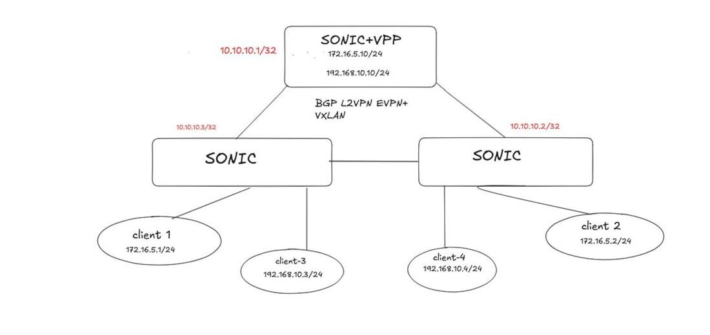

# Infrastructure Data Center Overlay EVPN-VXLAN — SONiC + FD.io VPP

Déploiement d'une infrastructure d'overlay réseau **EVPN-VXLAN** haute performance, combinant **SONiC** (VXLAN/EVPN) et **FD.io VPP** (passerelle L2/L3 logicielle), avec plan de contrôle automatisé via **BGP L2VPN EVPN (FRRouting)**.



## Architecture

| Nœud | Loopback (Router-ID) | Rôle | Interfaces / IP overlay |
|---|---|---|---|
| Serveur 1 — SONiC+VPP | 10.10.10.3 | Passerelle L2/L3 + Route Reflector BGP EVPN | BVI0: 172.16.5.10/24, BVI1: 192.168.10.10/24 |
| Serveur 2 — SONiC | 10.10.10.2 | VTEP / commutateur — client-2, client-4 | Vlan100 → VNI 100 |
| Serveur 3 — SONiC | 10.10.10.1 | VTEP / commutateur — client-1, client-3 | Vlan100 → VNI 100 |

## 1. Configuration SONiC (VTEP / VXLAN / VLAN)

```bash
# Créer le VTEP
sudo config vxlan add vtep1 10.10.10.3

# Activer EVPN NVO sur ce VTEP
sudo config vxlan evpn_nvo add nvo1 vtep1

# Créer le VLAN
sudo config vlan add 100

# Ajouter un membre au VLAN (nécessaire pour qu'il soit "actif" dans CONFIG_DB)
sudo config vlan member add 100 Ethernet0

# Mapper le VLAN au VNI
sudo config vxlan map add vtep1 Vlan100 100

# Attacher tap1 au bridge Linux
sudo ip link set tap1 master Bridge

# Assigner le VLAN à tap1 sur le bridge
sudo bridge vlan add vid 100 dev tap1 pvid untagged
```

## 2. Configuration BGP L2VPN EVPN (FRRouting)

### Serveur 1 — SONiC+VPP (Route Reflector, router-id 10.10.10.3)

```
router bgp 65100
 bgp router-id 10.10.10.3
 neighbor 172.16.1.1 remote-as 65100
 neighbor 172.16.1.1 route-reflector-client
 neighbor 172.16.1.2 remote-as 65100
 neighbor 172.16.1.2 route-reflector-client
 !
 address-family ipv4 unicast
  network 10.10.10.3/32
 exit-address-family
 !
 address-family l2vpn evpn
  neighbor 172.16.1.1 activate
  neighbor 172.16.1.1 route-reflector-client
  neighbor 172.16.1.2 activate
  neighbor 172.16.1.2 route-reflector-client
  advertise-all-vni
  advertise ipv4 unicast
 exit-address-family
```

### Serveur 2 — SONiC (router-id 10.10.10.2)

```
router bgp 65100
 bgp router-id 10.10.10.2
 neighbor 172.16.1.1 remote-as 65100
 neighbor 172.16.1.3 remote-as 65100
 !
 address-family ipv4 unicast
  network 10.10.10.2/32
 exit-address-family
 !
 address-family l2vpn evpn
  neighbor 172.16.1.1 activate
  neighbor 172.16.1.3 activate
  advertise-all-vni
  advertise ipv4 unicast
 exit-address-family
```

### Serveur 3 — SONiC (router-id 10.10.10.1)

```
router bgp 65100
 bgp router-id 10.10.10.1
 neighbor 172.16.1.2 remote-as 65100
 neighbor 172.16.1.3 remote-as 65100
 !
 address-family ipv4 unicast
  network 10.10.10.1/32
 exit-address-family
 !
 address-family l2vpn evpn
  neighbor 172.16.1.2 activate
  neighbor 172.16.1.3 activate
  advertise-all-vni
  advertise ipv4 unicast
 exit-address-family
```

### Vérification

```
sh bgp summary
sh bgp l2vpn evpn
sh bgp l2vpn evpn vni
```

## 3. Configuration FD.io VPP (passerelle)

```
config vpp create tap host-if-name tap1
set interface state tap0 up
create bridge-domain 100
ip table add 100
bvi create
set interface state bvi0 up
set interface l2 bridge bvi0 100 bvi
set interface l2 bridge tap0 100
set interface ip table bvi0 100
set interface ip address bvi0 172.16.5.10/24
sonic; sudo ip link set tap master Bridge
sonic; sudo bridge vlan add vid 100 dev tap pvid untagged

```

Vérification :

```
vpp# sh int address
bvi0 (up):  L2 bridge bd-id 100 idx 1 shg 0 bvi
            L3 172.16.5.10/24 ip4 table-id 100 fib-idx 1
bvi1 (up):  L2 bridge bd-id 200 idx 2 shg 0 bvi
            L3 192.168.10.10/24 ip4 table-id 200 fib-idx 2
tap0 (up):  L2 bridge bd-id 100 idx 1 shg 0
tap3 (up):  L2 bridge bd-id 200 idx 2 shg 0
```

## 4. Tests et validation

```bash
ping 172.16.5.2    # 3 paquets transmis, 3 reçus, 0% perte, rtt avg 0.092 ms
ping 172.16.5.10   # 2 paquets transmis, 2 reçus, 0% perte, rtt avg 0.168 ms

ip neighbor show
# 172.16.5.10 dev veth_ns1 lladdr b0:b0:00:00:00:00 STALE
# 172.16.5.2  dev veth_ns1 lladdr 12:57:fe:88:5a:11 STALE
```

L'apprentissage de la MAC distante `12:57:fe:88:5a:11` confirme la propagation des routes EVPN de type 2 (MAC/IP) via BGP, sans configuration statique.

| Composant / Test | Détails | Validation |
|---|---|---|
| Passerelle VPP BVI0 | 172.16.5.10/24 — BD-ID 100 | Joignable, RTT moyen 0,08 ms |
| Passerelle VPP BVI1 | 192.168.10.10/24 — BD-ID 200 | Second domaine L2/L3 isolé |
| Tunnel VXLAN L2 | Client 1 ↔ Client 2 | 100% de succès, 0% perte |
| Table ARP/Neighbor | MAC distante apprise | Propagation réussie via BGP EVPN |

## Conclusion

- **Plan de contrôle automatisé** : échange dynamique MAC/IP et création automatique des tunnels VXLAN via BGP EVPN
- **Haute performance** : routage inter-domaines < 0,1 ms grâce à VPP et aux interfaces BVI
- **Connectivité L2/L3 validée** : communication transparente entre tous les clients

---
**Auteur :** Essaghiry Khalid
